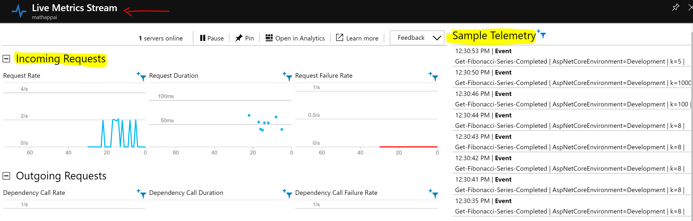
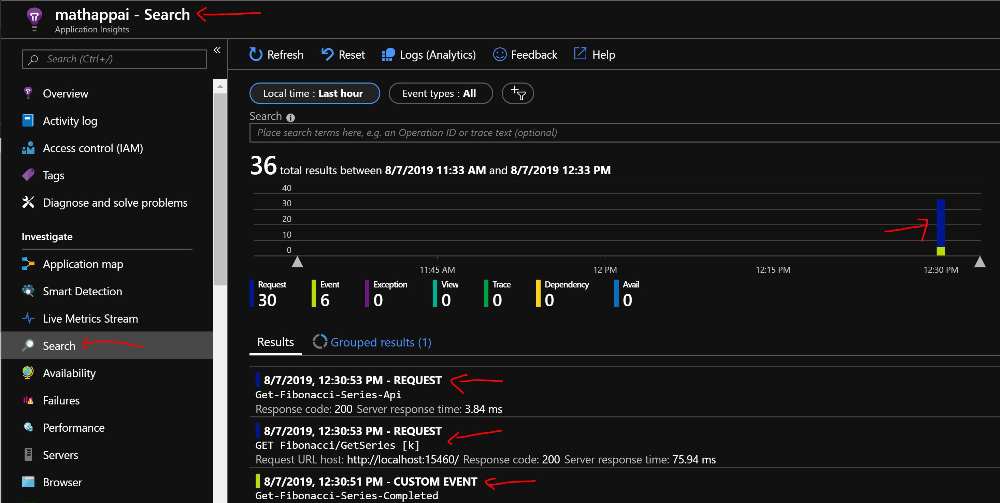
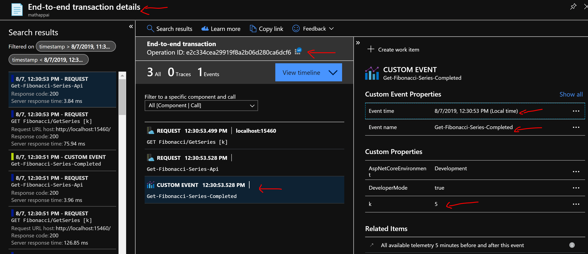

# Math REST API

## Overview
This is a ASP.NET Core REST API sample application, which implement the Fibonacci series.

The following technologies were used:
* .NET Standard 2.0
* ASP.NET Core 2.1
* C#
* NUnit 3
* Postman
* Visual Studio 2017 Enterprise Edition (version 15.9.12)
* Windows 10


## What will you need?

* Visual Studio 2019 [Download](https://visualstudio.microsoft.com/vs) (Please note this is may require upgrading the solution)
* .NET Core SDK 2.1 [Download](https://dotnet.microsoft.com/download/dotnet-core/2.1)
* Postman [Download](https://www.getpostman.com/downloads/)


## Solution Projects
* **Math.Core**: core logic of the application decoupled form the REST API, which is suitable for extensibility and evolution of the system (e.g. CLI, Windows Application, etc.).
* **Math.Core.UnitTest**: unit tests for the core logic.
* **MathApi**: REST API.


## NuGet packages by Project
**Math.Core**
* Microsoft.ApplicationInsights (version 2.11.0-beta1)
* NETStandard.Library (version 2.0.3)

**Math.Core.UnitTest**
* Microsoft.NET.Test.Sdk (version 16.3.0-preview-20190715-02)
* Microsoft.NETCore.App (version 2.1.0)
* NUnit (version 3.12.0)
* NUnit3TestAdapter (version 3.13.0)

**MathApi**
* Microsoft.ApplicationInsights.AspNetCore (version 2.8.0-beta1)
* Microsoft.AspNetCore.App (version 2.1.1)
* Microsoft.NETCore.App (version 2.1.0)

## Running the application
* Open solution in Visual Studio (Math.sln file).
* Make sure MathApi is set as the startup project.
* Run the application by pressing F5 or through menu Debug > Start Debugging.
* Open Postman and send request ```GET http://localhost:15460/api/math/series/Fibonacci/5```

## API Documentation

The following headers will be present in all responses:
* **X-MathApi-Request-Id**: telemetry operation ID, which is useful for traceability purposes.
* **X-MathApi-Request-Timestamp**: telemetry operation ID, which is useful for traceability purposes.
* **X-MathApi-Server-ExecutionTimeMs**: server-side execution time in milliseconds, which is useful to detect/troubleshoot network issues between server and client communication.

### /api/math/series/Fibonacci/{k}
* Returns the Fibonacci series for K elements.
* Accepted K range is from 1 to 30000, which means requests where K is <1 or >30000 the response will be HTTP 404.

### /api/KeepAlive
* Often used by monitoring tools/load balancers to detect connectivity issues to alert and/or redirect traffic as well as keeping the process warm.

## Telemetry

The application is configured to publish telemetry data to Azure Application Insights.

Provision your own Application Insights and change the following configuration to send telemetry data to it.

**appsettings.json**
```json
{
    "ApplicationInsights": {
        "InstrumentationKey": "<Add your instrumentation key here>"
    },
    "Logging": {
        "LogLevel": {
            "Default": "Warning"
        }
    },
    "AllowedHosts": "*"
}
```

**Live Stream**


**Search**


**End To End Telemetry**
